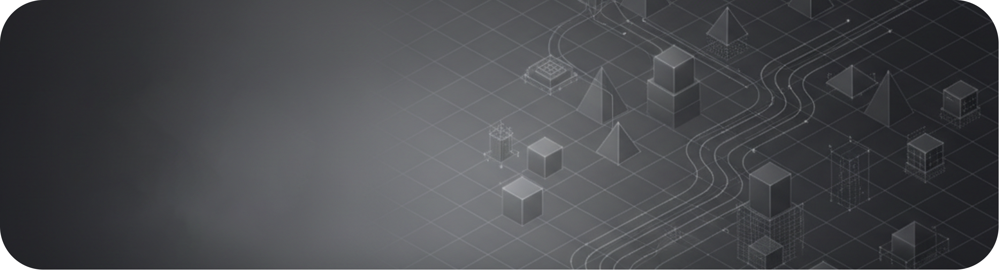

  

<h2 align="center">Building • Learning • Experimenting</h2>

  Exploring Machine Learning, Deep Learning & Natural Language Processing through practical projects.

---

## About

I'm building my foundation in **Artificial Intelligence and Machine Learning** through hands-on projects and experimentation.

My current focus is on understanding how models work, implementing concepts in Python, and gradually moving toward modern **NLP and language-based AI systems**.

I prefer learning by building and understanding the underlying concepts rather than simply using pre-built solutions.

---

## Current Focus

* Machine Learning with Python & Scikit-learn
* Deep Learning with PyTorch
* Natural Language Processing
* Text Embeddings & Representations
* Semantic Search
* Transformers

---

## Selected Projects

### 🧠 Scientific Semantic Search

A research-oriented project exploring semantic search over scientific texts.

The project compares traditional **TF-IDF retrieval** with **neural sentence representations**, focusing on how semantic representations affect information retrieval.

**Focus:** NLP · Embeddings · Information Retrieval · Evaluation

---

### 👁️ Computer Vision

Practical experiments with image processing and face detection using Python and OpenCV.

**Focus:** Computer Vision · Image Processing · OpenCV

---

### 🕸️ Graph Analysis

Exploring graph-based representations, network analysis, and anomaly detection using Python and NetworkX.

**Focus:** Graph Theory · Network Analysis · Data Analysis

---

## Tech Stack

**Languages & Tools**

`Python` · `SQL`

**Data & Machine Learning**

`NumPy` · `Pandas` · `Matplotlib` · `Scikit-learn`

**Deep Learning & AI**

`PyTorch` · `NLP` · `Embeddings` · `Semantic Search`

**Other**

`OpenCV` · `NetworkX` · `Git` · `GitHub`

---

## GitHub

Most of the repositories here are part of my learning journey, experiments, and practical projects.

As I progress, I aim to turn the most useful experiments into focused, documented projects.

---

  <i>Learn the concepts. Build the system. Understand how it works.</i>

